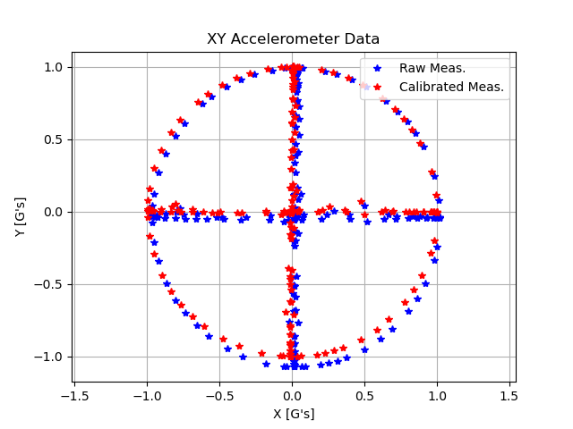
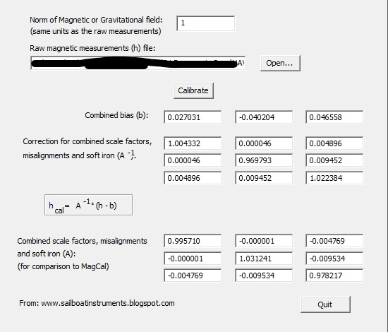
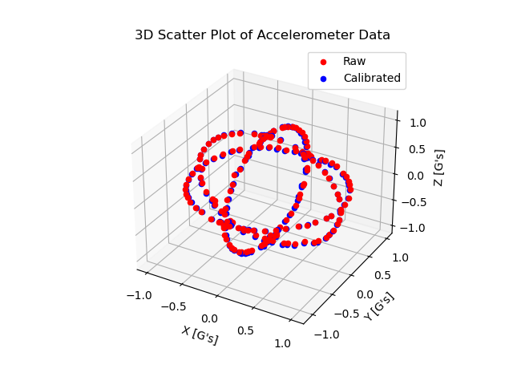

# Accelerometer Calibration Procedure

A general method (with Python scripts) for calibrating accelerometer sensors.

**Developed By:** [Michael Wrona](https://lksg.me/u/michaelwro), *B.S. Aerospace Engineering*

**GitHub:** [@michaelwro](https://github.com/michaelwro)

**YouTube:** [@MicWro Engr](https://www.youtube.com/channel/UCIeZzuXHGm7zqSFvT8xGoIQ)

**Blog:** [mwrona.com](https://mwrona.com)



### Pip Install Python3 Dependencies

```bash
$ pip3 install numpy matplotlib pandas  # pip for Windows
```

### Conda Install Python3 Dependencies

```bash
(myenv) $ conda install -c conda-forge numpy matplotlib pandas
```

---

**IMPORTANT:** Before following these steps, I highly recommend watching the video I created about this process. You can watch it [at this link](https://www.youtube.com/watch?v=-1tmYPE7MAQ).

## Step 1: Output Comma-Separated Data

`record-data.py` expects to read comma-separated accelerometer data from a serial connection. Each sensor is different, so you will need to write your own microcontroller code to output comma-separated accelerometer measurements to a serial port, similar to this format:

```bash
0.0642208,-0.05490976,1.02357024
```

## Step 2: Configure `record-data.py`

Open `record-data.py` in a text editor. Change the variables at the top as required.

## Step 3: Measure Accelerometer Data

Once you can output comma-separated raw accelerometer measurements over a serial connection, you can begin logging data. Run `record-data.py` to begin logging data. Have the accelerometer flat and stationary and press ENTER as prompted. Then, type 'm' as prompted to take a measurement. Move the accelerometer to a different orientation, then take another measurement. Repeat for many accelerometer orientations (sideways, upside down, left, right, etc.).

## Step 4: Save Measurements to File

Once you are satisfied with the number of measurements, type 'q' to save the measurements to a tab-delimited file.

## Step 5: Calibrate with Magneto

[Magneto](https://sites.google.com/site/sailboatinstruments1/home) is an [ellipsoid-fitting](https://www.mathworks.com/help/fusion/ug/magnetometer-calibration.html) software used to calibrate accelerometer and magnetometer sensors. Magneto expects raw measurements to be input as a tab-delimited text file. The norm of the gravitational field will be the ideal magnitude of your accelerometer measurements. For example, my accelerometer output data in G's, so my norm/magnitude would be 1. Load your text file generated by `record-data.py`, then click 'calibrate.' BAM! It's that easy!



## Step 6: Visualize Results

Open `plot-calibration-data.py` in a text editor. Copy the A^-1 matrix and bias vector values to the Python code and specify the tab-delimited text file of uncalibrated measurements. Run the code and compare uncalibrated and calibrated data!


## Resources

* [Magneto download link](https://sites.google.com/site/sailboatinstruments1/home)
* [YouTube video](https://www.youtube.com/watch?v=-1tmYPE7MAQ)
* [GitHub code repo](https://github.com/michaelwro/accelerometer-calibration)

